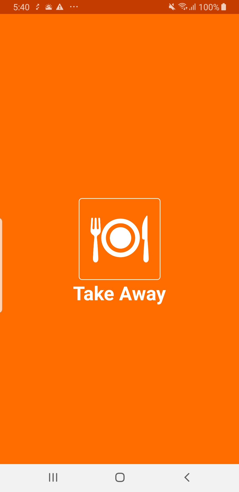
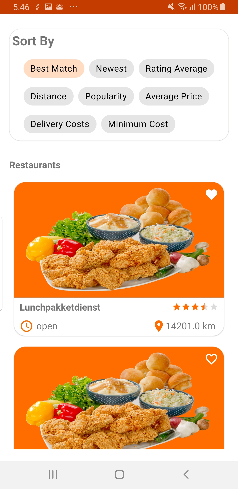
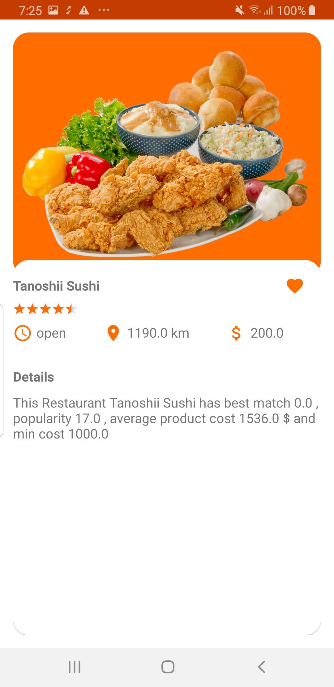

# TakeAway Application Sample
This is a sample Application for showing list of restaurants and their details, that implements clean architecture MVVM/MVI using Kotlin, coroutines, Hilt, Room, navigation component 
and architecture components with unit tests using Junit 4 and Mockk.

   

## Architecture
- Clean Architecture
- MVVM / MVI 

## Stack
- Kotlin
- Coroutines
- Architecture Components
    * View Binding
    * ViewModel
    * LiveData
    * Room
- Navigation Components
- Hilt (Dependency Injection)

## Testing
- Unit tests
    * Junit 4
    * Mockk

## Network APIS
- upload json into https://getsandbox.com/
- API URL: https://take-away.getsandbox.com:443/restaurants

# License

    Copyright 2021 Romisaa Hussien

    Licensed under the Apache License, Version 2.0 (the "License");

    you may not use this file except in compliance with the License.

    You may obtain a copy of the License at

       http://www.apache.org/licenses/LICENSE-2.0

    Unless required by applicable law or agreed to in writing, software

    distributed under the License is distributed on an "AS IS" BASIS,

    WITHOUT WARRANTIES OR CONDITIONS OF ANY KIND, either express or implied.

    See the License for the specific language governing permissions and

    limitations under the License.